Over the last several months, I've been exploring some different ways of rendering my code and algorithms as _physical_ outputs. I'm interested in the idea of creating real, tangible objects that are no longer bound by the generative systems that created them.

My interest in this began in March 2017, when I purchased my first pen plotter: the AxiDraw V3 by Evil Mad Scientist Laboratories. It's a fantastic machine, and has opened a whole new world of thinking for me. For those unaware, a pen plotter is a piece of hardware that acts like a robotic arm on which you can attach a regular pen. Software sends commands to the device to raise, reposition, and lower its arm across a 2D surface. With this, the plotter can be programmed to produce intricate and accurate prints with a pen and paper of your choice.


<sup><em>— Early prints, March 2017</em></sup>

Unlike a typical printer, a plotter produces prints with a strangely human quality: occasional imperfections arise as the pen catches an edge or momentarily dries up, and the quality of the ink has the subtle texture and emboss that you normally only see in an original drawing.

Often, these plotters and mechanical devices are controlled by G-code: a file format that specifies how the machine should lift, move, and place itself over time. AxiDraw handles most of the mechanical operation for you, providing a convenient SVG plugin that accepts paths, lines, shapes, and even fills (through hatching).


<sub><em>— Tesselations, August 2017</em></sub>

You don't need to be a programmer to use the AxiDraw pen plotter. You can create SVG files in Adobe Illustrator or find SVGs online to print. However, the machine is very well suited to programmatic and algorithmic line art, as it can run for hours at a time and produce incredibly detailed outputs that would be too tedious to illustrate by hand. With generative programs, they can be re-run to create endless variations, each one producing a unique print.

For example, my _Natural Systems_ series is 4 different algorithms, but they produce unique variations each time the algorithm is run.

[](https://svbtleusercontent.com/yglgzqitzhhhjq.png)  
[](https://svbtleusercontent.com/fzgfbxsvt7gp9w.png)

<sub><em>— Natural Systems, November 2017</em></sub>

This isn't a new concept; Vera Molnár, an early pioneer of computer art, was rendering pen plotter prints in the 1960s. Thanks to today's software and hardware, the whole process has become much more accessible.

[](https://svbtleusercontent.com/q0miknm8brx6sw.jpg)

<sub><em>— Vera Molnár, No Title, 1968</em></sub>

## Process

So far, all of my work with the AxiDraw has been with JavaScript and an experimental tool I've been building, aptly named [penplot](https://github.com/mattdesl/penplot). The tool primarily acts as a development environment, making it easier to organize and develop new prints with minimal configuration.

You can try the tool out yourself with `node@8.4.x` and `npm@5.3.x` or higher

```sh
# install the CLI app globally
npm install penplot -g

# run it, generating a new file and opening the browser
penplot test-print.js --write --open
```

The `--write` flag will generate a new `test-print.js` file and `--open` will launch your browser to `localhost:9966`. It starts you off with a basic print:

[](https://svbtleusercontent.com/yo4l9mjhg6vdq.jpg)

The generated `test-file.js` file is ready to go; you can edit the ES2015 code to see changes reflected in your browser. When you are happy, hit `Cmd + S` (save PNG) or `Cmd + P` (save SVG) to export your print from the browser.

> 🚨 This tool is highly experimental and subject to change as my workflow evolves.

## Developing a Print

For algorithmic work with AxiDraw and its SVG plugin, I tend to distill all my visuals into a series of polylines.

```js
const lines = [
  [
    [ 1, 1 ], [ 2, 1 ]
  ],
  [
    [ 1, 2 ], [ 2, 2 ]
  ]
]
```

> 💡 Penplot scales the Canvas2D context before drawing, so all of your units should be in centimeters.

This creates two horizontal lines in the top left of our print, each 1 cm wide. Here, points are defined by `[ x, y ]` and a polyline (i.e. path) is defined by the points `[ a, b, c, d, .... ]`. Our list of polylines is defined as `[ A, B, ... ]`, allowing us to create multiple disconnected segments (i.e. where the pen lifts to create a new line).

[](https://svbtleusercontent.com/vrfsyoiy7y7q.png)

So far, the above code doesn't feel very intuitive, but you will hardly ever hardcode coordinates like this. Instead, you should try to think in geometric primitives: points, squares, lines, circles, triangles, etc. For example, to draw some squares in the center of the print:

```js
// Function to create a square
const square = (x, y, size) => {
  // Define rectangle vertices
  const path = [
    [ x - size, y - size ],
    [ x + size, y - size ],
    [ x + size, y + size ],
    [ x - size, y + size ]
  ];
  // Close the path
  path.push(path[0]);
  return path;
};

// Get center of print
const cx = width / 2;
const cy = height / 2;

// Create 12 concentric pairs of squares
const lines = [];
for (let i = 0; i < 12; i++) {
  const size = i + 1;
  const margin = 0.25;
  lines.push(square(cx, cy, size));
  lines.push(square(cx, cy, size + margin));
}
```

The result looks a bit like this:

  
<sup>✏️ See [here](https://google.com/) for the final source code of this print.</sup>

This is starting to get a bit more interesting, but you may be wondering why not just reproduce this by hand in Illustrator. So, let's see if we can create something more complex in code.

## Importing Libraries

A simple starting task would be to explore Delaunay triangulation. For this, we will use [delaunay-triangulate](http://npmjs.com/package/delaunay-triangulate), a robust triangulation library by Mikola Lysenko that works in 2D and 3D. We will also use the [new-array](https://www.npmjs.com/package/new-array) module, a simple array creation utility.

Before we begin, you'll need to install some dependencies locally:

```sh
# generate a package.json in your current folder
npm init -y

# install some required dependencies
npm install delaunay-triangulate new-array
```

In our JavaScript code, let's `import` some of our modules and define a set of 2D points randomly distributed across the print, inset by a small margin.

We use the built-in penplot `random` library here, which has the function `randomFloat(min, max)` for convenience.

```js
import newArray from 'new-array';
import { randomFloat } from 'penplot/util/random';

...

  const pointCount = 200;
  const positions = newArray(pointCount).map(() => {
    // Margin from print edge in centimeters
    const margin = 2;
    // Return a random 2D point inset by this margin
    return [
      randomFloat(margin, width - margin),
      randomFloat(margin, height - margin)
    ];
  });
```

> :bulb: I often use `new-array` and `map` to create a list of objects, as I find it more modular and functional than a for loop.

If we were to visualize our points as circles, it might look like this:

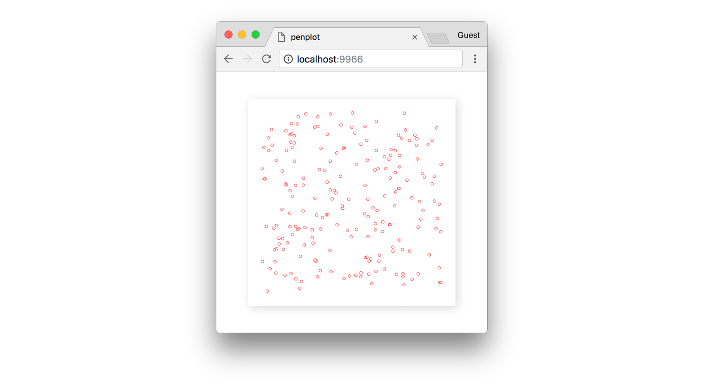

The next step is to triangulate these points, i.e. turn them into triangles. Simply feed the array of points into the `triangulate` function and it returns a list of "cells."

```js
import triangulate from 'delaunay-triangulate';

...

  const cells = triangulate(positions);
```

The return value is an array of triangles, but instead of giving us the 2D positions of each vertex in the triangle, it gives us the index into the `positions` array that we passed in.

```js
[
  [ 0, 1, 2 ],
  [ 2, 3, 4 ],
  ...
]
```

For example, to get the 3 vertices of the first triangle:

```js
const triangle = cells[0].map(i => positions[i]);

// log each 2D point in the triangle
console.log(triangle[0], triangle[1], triangle[2]);
```

For the print, we want to map each triangle to a polyline that the pen plotter can render out.

```js
const lines = cells.map(cell => {
  // Get vertices for this cell
  const triangle = cell.map(i => positions[i]);
  // Close the path
  triangle.push(triangle[0]);
  return triangle;
});
```

Now we have all the lines we need to send the SVG to AxiDraw. In the browser, hit `Cmd + S` and `Cmd + P` to save a PNG and SVG file, respectively, into your Downloads folder.

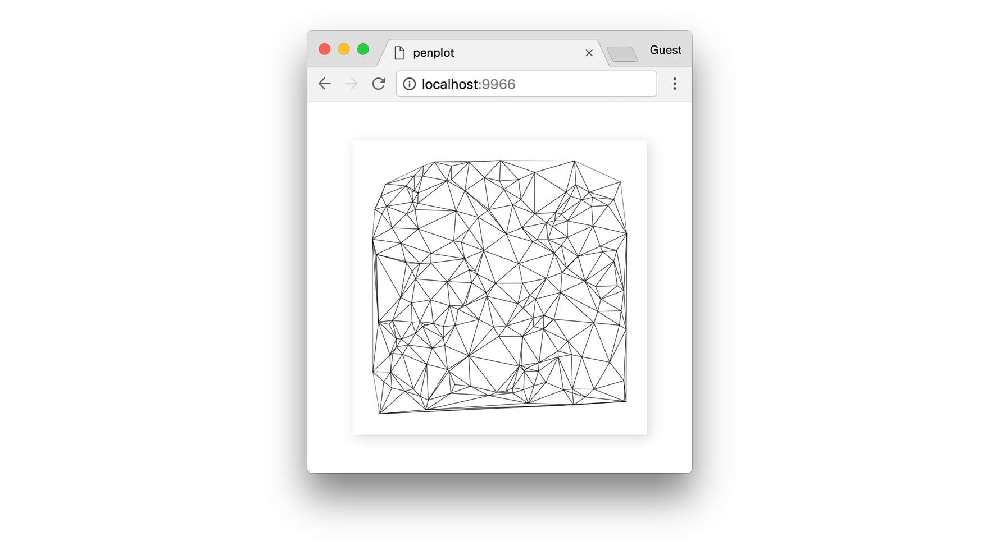

For reference, below you can see how our original random points have now become the vertices for each triangle:

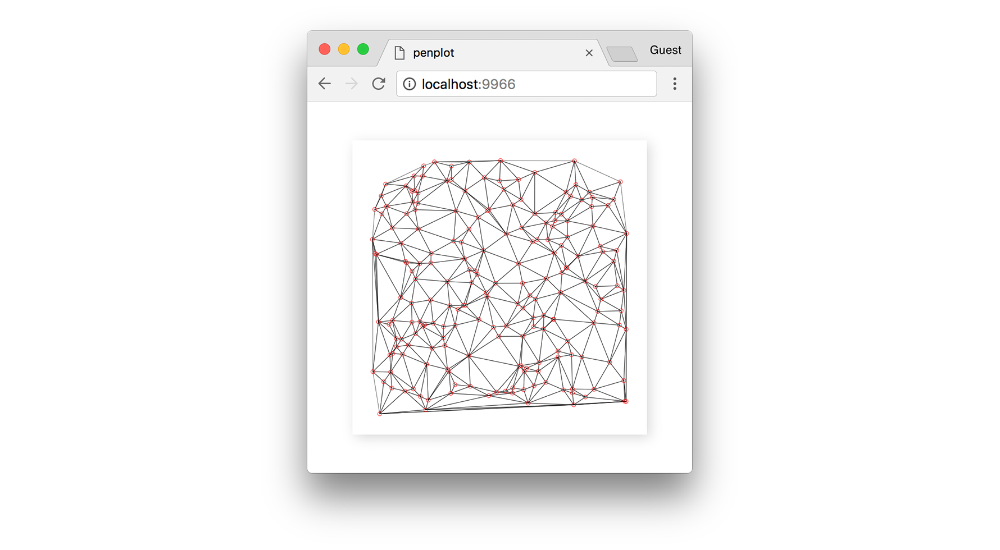

> :bulb: The `random` module includes a `setSeed(n)` function, which is useful if you want predictable randomness every time the page reloads.

If we increase the `pointCount` to a higher value, we start to get a more well-defined edge, and potentially a more interesting print.

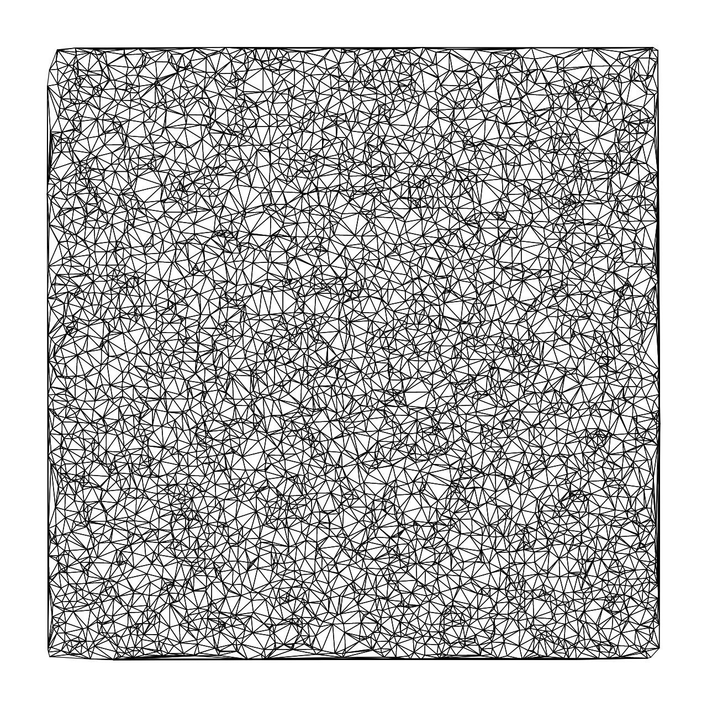

> ###### :pencil2: See [here](#) for the final source code of this print. 

# Patchwork

Now let's try something different and develop an algorithm that runs over time. I'm calling this algorithm "Patchwork," although I won't claim to have invented it since I'm sure many before me have discovered the same algorithm.

The algorithm we will try to implement works like so:

1. Start with a set of *N* initial points.
2. Select a cluster of points and draw the convex hull that surrounds all of them.
3. Remove the points contained by the convex hull from our data set.
4. Repeat the process from step 2.

The "convex hull" is a convex polygon that encapsulates a set of points; it's a bit like if we hammered nails down at each point, and then tied a string around them to create a closed shape.

To select a cluster, we will use [k-means](https://en.wikipedia.org/wiki/K-means_clustering) to partition the data into N clusters, and then select whichever cluster has the least amount of points. There are likely many ways you can randomly select clusters, perhaps more optimally than with k-means.

Install the required libraries first, and then generate a new plot:

```sh
# install dependencies
npm install density-clustering convex-hull

# generate a new plot
penplot patchwork.js --write --open
```

Now, let's begin by adding the random points back in and stubbing out a `step` function for our algorithm. We also need to turn `animate` to true, so that `penplot` will start a render loop instead of just drawing one frame.

```js
...

import { PaperSize, Orientation } from 'penplot';
import { randomFloat } from 'penplot/util/random';
import newArray from 'new-array';
import clustering from 'density-clustering';
import convexHull from 'convex-hull';

export const orientation = Orientation.LANDSCAPE;
export const dimensions = PaperSize.SQUARE_POSTER;

export default function createPlot (context, dimensions) {
  const [ width, height ] = dimensions;

  // A large point count will produce more defined results
  const pointCount = 500;
  let points = newArray(pointCount).map(() => {
    const margin = 2;
    return [
      randomFloat(margin, width - margin),
      randomFloat(margin, height - margin)
    ];
  });

  // We will add to this over time
  const lines = [];

  // The N value for k-means clustering
  // Lower values will produce bigger chunks
  const clusterCount = 3;

  // Run our generative algorithm at 30 FPS
  setInterval(step, 1000 / 30);

  return {
    draw,
    print,
    background: 'white',
    animate: true // start a render loop
  };

  function step () {
    // Our generative algorithm...
  }

  // ... draw / print functions ...
}
```

You won't see anything if you run the code, that's because our `lines` array is empty. However, we can already visualize our random points:

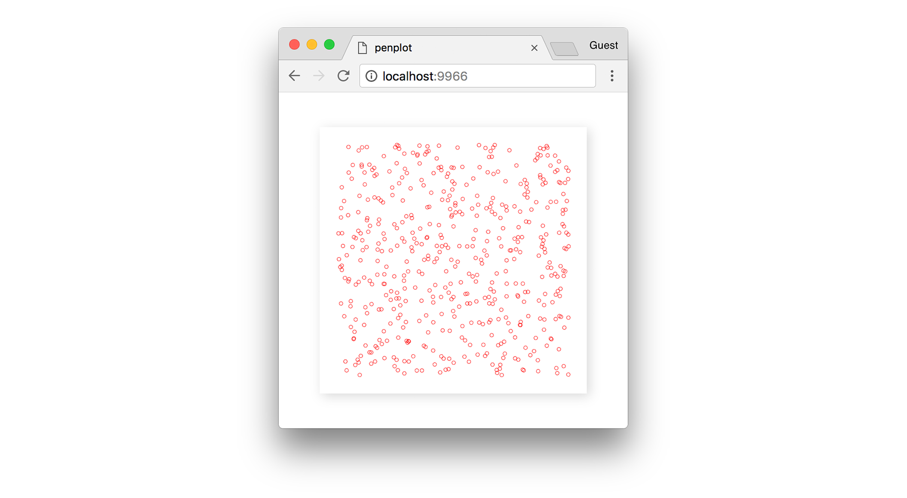

Let's make it so that each time `step` runs, it adds a new polyline to the array. The next step in our algorithm is to select a cluster of points from our data set. We will use the `density-clustering` module for this, filtering the result to ensure we select a cluster with at least 3 points. Then, we sort by ascending density to select the cluster with the least number of points (i.e. the first).

Like with `triangulate()`, the density clustering returns a list of _indices_, not points, so we need to map the indices to their corresponding positions.

```js
function step () {
  // Not enough points in our data set
  if (points.length <= clusterCount) return;

  // k-means cluster our data
  const scan = new clustering.KMEANS();
  const clusters = scan.run(points, clusterCount).filter(c => c.length >= 3);

  // Ensure we resulted in some clusters
  if (clusters.length === 0) return;

  // Sort clusters by density
  clusters.sort((a, b) => a.length - b.length);

  // Select the least dense cluster
  const cluster = clusters[0];
  const positions = cluster.map(i => points[i]);

  ...
}
```

Now that we have a cluster, we can find the convex hull of its points, and removes those points from our original data set. The `convexHull` module returns a list of `edges` (i.e. line segments), and by taking the first vertex in each edge, we can form a closed polyline (polygon) for that cluster.

```js
function step () {
  // Select a cluster
  ...

  // Find the hull of the cluster
  const edges = convexHull(positions);

  // Ensure the hull is large enough
  if (edges.length <= 2) return;

  // Create a closed polyline from the hull
  let path = edges.map(c => positions[c[0]]);
  path.push(path[0]);

  // Add to total list of polylines
  lines.push(path);

  // Remove those points from our data set
  points = points.filter(p => !positions.includes(p));
}
```

Below, we can see what it looks like when we find the convex hull of the set of blue points.

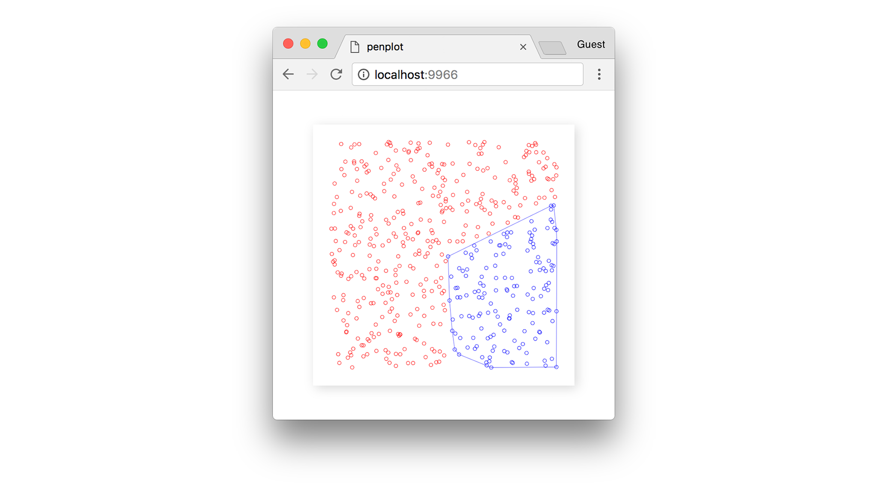

Once the points from that cluster are removed from the data set, we are left with a polygon in their place.

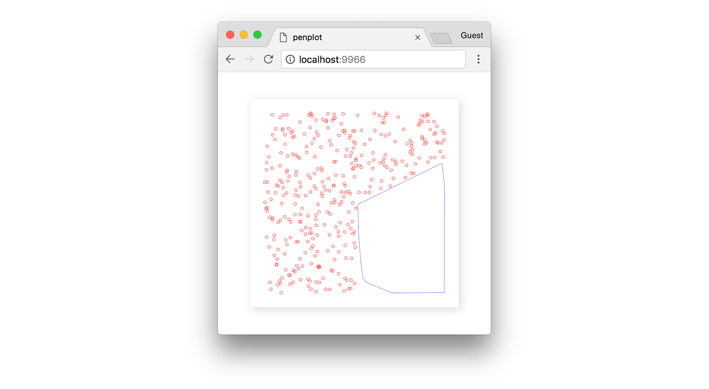

As we continue stepping the algorithm forward, we end up with more polygons filling in the empty space.

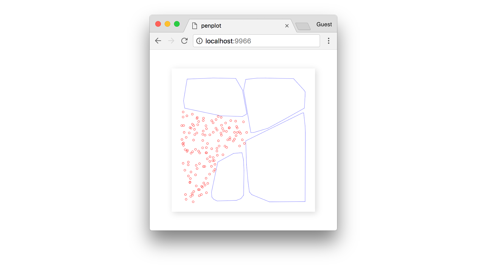

Until eventually the algorithm converges, and we can find no more suitable clusters.

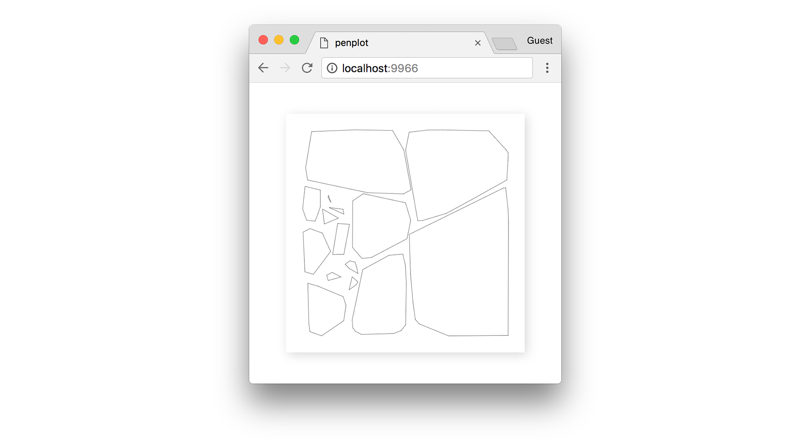

Like in the triangulation example, let's increase our `pointCount` to get a more interesting output. With a high number, like 50,000 points, we will get more detail and smoother polygons.

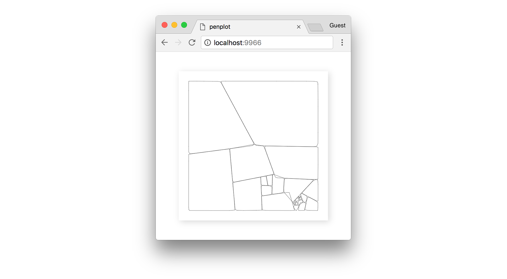

> ###### :pencil2: See [here](#) for the final source code of this print. 

The real beauty in this algorithm comes from recursing it; after it converges, you can select a new polygon, fill it with points, and re-run the algorithm from step 2. After many iterations, you can end up with incredibly detailed patterns. 

Below are a few other examples after spending an evening refining and tweaking the algorithm. These particular outputs use Canvas2D `fill()`, thus aren't suitable for a pen plotter.

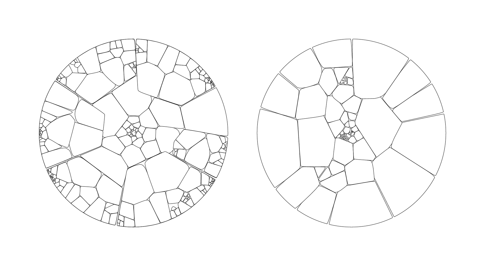  
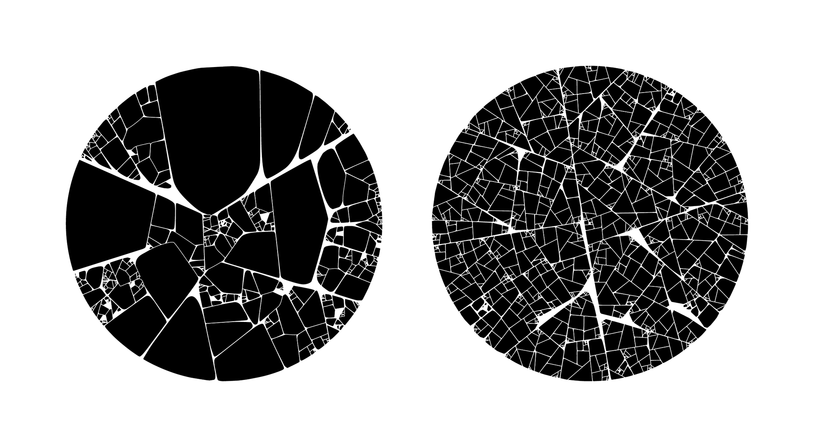  
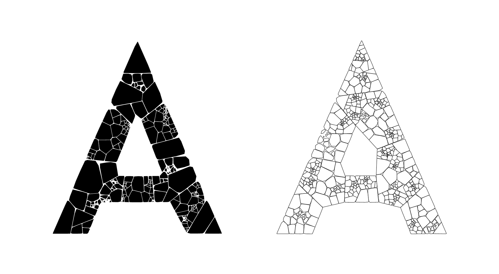  

The "Patchwork" algorithm can also be extended to 3D, potentially for use in parametric modelling. However, that's a subject for another blog post. 